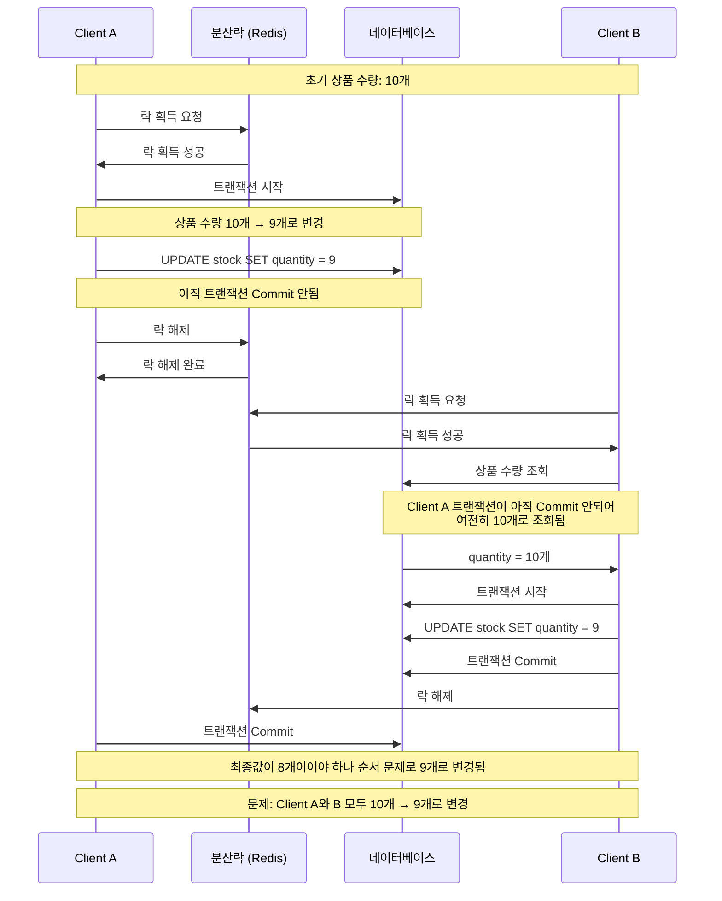

# 분산락 (Distributed Lock)

비관적 락(Pessimistic Lock)과 낙관적 락(Optimistic Lock)과 함께 사용되는 락 방법입니다. 낙관적 락은 충돌 빈도가 높은 경우 성능 이슈가 발생하고 비관적 락은 데이터베이스 Row 단위로 락을 걸기 때문에 성능 이슈 또는 아직 존재하지 않는 데이터를 대상으로는 락을 갈 수 없는 단점이 있습니다.
분산 락은 여러 대의 서버를 대상으로 락을 제어할 수 있고 Row 단위가 아니라 Critical Section(임계 구역)에 락을 걸어 위 문제를 해결합니다.

대표적인 구현 방법으로 Zookeeper와 Redis가 있습니다. 두 구현 방법 모두 인프라 구성이 필요하지만, Zookeeper는 성능 튜닝이 까다로운 단점이 있습니다.
Redis는 인메모리 데이터베이스 특징을 살려 분산 락 외에도 다른 용도로 사용할 수 있습니다. (Zookeeper를 다른 용도로 사용한다면 Kafka 메타데이터 정도)
MySQL으로도 분산 락을 구현할 수 있지만 락을 사용하기 위해 커넥션을 소모하고 분산 락에 관련된 부하가 데이터베이스로 전파되는 단점이 있습니다.

자바에서 Redis로 분산 락을 사용할 때 Redis 클라이언트로 Lettuce 또는 Redisson 라이브러리를 사용합니다.

## Lettuce

Lettuce에서는 `SETNX` 명령어로 분산 락을 구현합니다. Redis에 값이 있는지 확인하고 없다면 값을 설정하는 명령어입니다. `TTL` 옵션을 설정해 데드락 발생을 막을 수 있습니다.

임의의 Lock Key를 사용해서 키가 존재하는지 확인하고 없다면(=아무도 점유하고 있지 않다면) 값을 설정해서 락을 겁니다. 다른 클라이언트는 락이 걸려있는지 확인하기 위해 주기적으로 Redis에 요청을 보냅니다. 이 요청을 보내는 과정을 Spin Lock이라고 합니다. 클라이언트가 많을 때 Spin Lock 단점이 뚜렷해지는데, 클라이언트가 100개 있고 현재 자원을 점유하고 있는 클라이언트 A가 있다고 가정해봅니다. 나머지 클라이언트 99개는 락이 걸려있는지 확인하기 위해 매번 Redis에 요청을 보내야하는 문제가 발생합니다.

## Redisson

Redisson에서는 Spin Lock에서 생긴 문제를 Pub/Sub 구조로 해결합니다. Redis Pub/Sub 기능을 사용해서 락 해제가 됐으면 Redis에서 클라이언트에게 메시지를 보내 이를 알려줍니다. 또한 락 점유, 해제 과정을 Lua Script로 작성했기 때문에 원자 단위로 작동하게 됩니다.

Spring Framework 환경에서는 AOP를 사용해 이를 구현할 수 있습니다. 새로운 트랜잭션으로 시작할 수 있도록 `@Transactional` 어노테이션의 `propagation` 옵션에 `REQUIRES_NEW`을 적용해야 합니다.

락을 해제할 때는 반드시 트랜잭션을 먼저 Commit하고 락을 해제해야 합니다. Client A에서 상품 개수를 10개에서 9개로 변경하고 락을 해제한다고 가정해봅니다. 아직 트랜잭션 Commit은 일어나지 않은 상태입니다. 락이 해제됐기 때문에 Client B가 락을 획득해 개수를 차감할 수 있고 이때 Client A의 동작이 Commit 되지 않아 Client B도 상품 개수를 10개에서 9개로 변경하게 됩니다. 원래라면 Client A에서 10개 -> 9개, Client B에서 9개 -> 8개로 변경되어야 하지만 트랜잭션 Commit이 일어나지 않아 원하는 결과가 나오지 않습니다.

위 잘못된 시나리오를 다이어그램으로 나타내면 아래와 같습니다.

트랜잭션을 먼저 Commit하고 락을 해제해서 정합성 문제를 해결할 수 있습니다.
