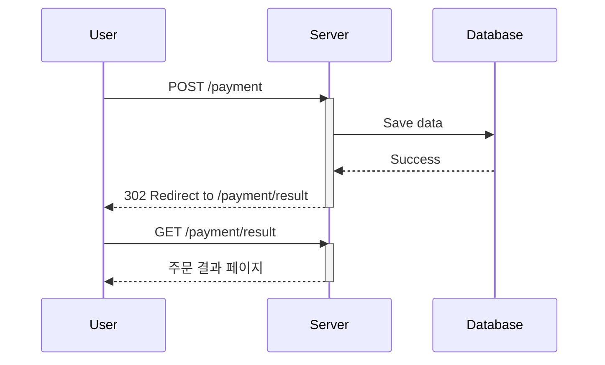

# PRG (Post-Redirect-Get) Pattern

PRG 패턴은 POST Method에서 멱등성을 보장하기 위해 사용하는 패턴입니다. Fullname에서 볼 수 있는 것 처럼, POST 요청 후 응답으로 Redirect를 받고, Redirect 이후 GET 요청을 보냅니다.
웹에서 주문 버튼을 클릭했다고 가정했을 때, 새로고침을 하면 한번 더 주문 요청이 들어가는 문제가 발생하는데 PRG 패턴으로 이를 해결할 수 있습니다.

주문 과정을 예시로 들면:

1. 사용자(클라이언트)가 주문을 하면 서버로 POST 요청을 보냅니다. 서버에서는 주문 기록을 데이터베이스에 저장합니다.
2. 서버는 클라이언트에게 302 Http Status\*와 함께 Redirect 응답을 보냅니다. 클라이언트는 Redirect 응답을 받아 새로운 페이지로 이동합니다. \*302 Found 코드는 일시적인 리다이렉션으로 검색 엔진이 URL을 갱신하지 않습니다.

3. 클라이언트는 새로운 URL으로 GET 요청을 보냅니다. 이후 서버에서는 주문 결과 등의 내용을 사용자에게 최종적으로 전달합니다.

