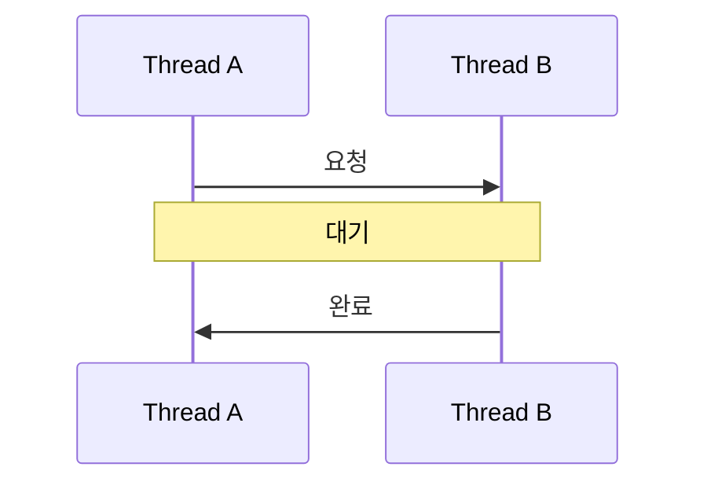
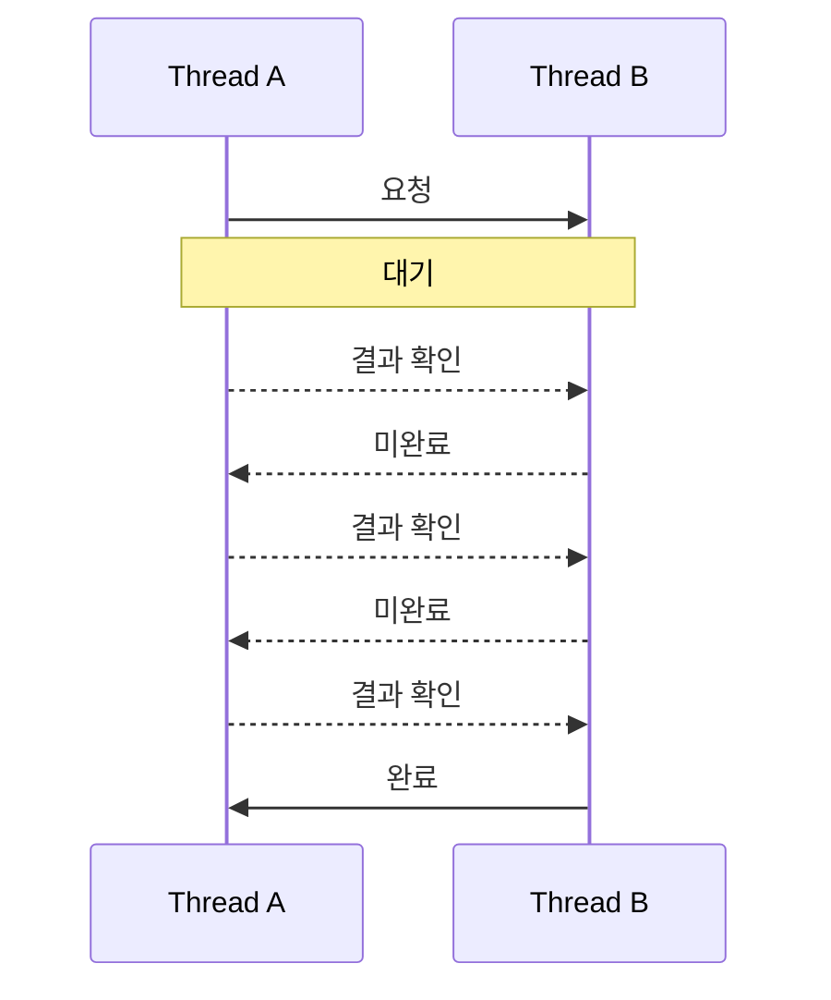
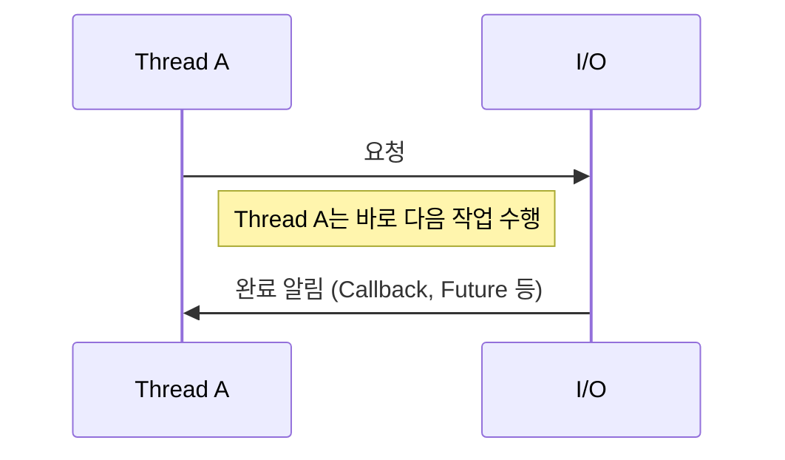
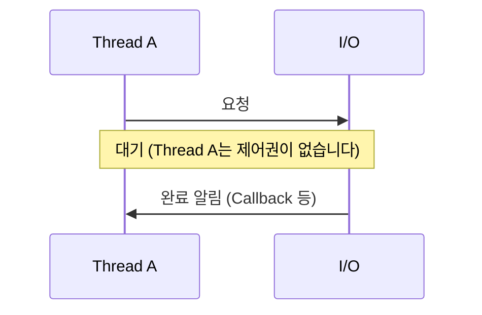

# 블로킹과 논블로킹, 동기와 비동기

블로킹과 논블로킹은 결과를 기다릴 때 어떻게 할 것인가를 다룹니다. 비슷하지만 다른 개념은 동기와 비동기는 결과를 기다리는 주체가 누구인가를 다룹니다.

## 블로킹(Blocking)과 논블로킹(Non-Blocking)

'결과를 기다릴 때 어떻게 할 것인가' 더 깊게 들가면 제어권에 대한 차이가 있습니다.

가상의 두 Thread A와 B가 있다고 가정해봅니다.

블로킹은 Thread A가 Thread B에게 요청을 한 후 그 결과가 올 때까지 **기다립니다.** 제어권을 Thread B에게 넘겨주었기 때문에 제어권이 다시 넘어올 때까지 Thread A는 기다려야 합니다.

논블로킹은 Thread A가 Thread B에게 요청을 한 후 결과를 **기다리지 않습니다.** 제어권을 여전히 Thread A가 갖고있기 때문에 언제든지 다른 작업을 계속 할 수 있습니다.

## 동기(Synchronous)와 비동기(Asynchronous)

동기는 **결과를 기다리는 주체가 Thread A**입니다. 반대로 비동기에는 **결과를 기다리는 주체가 Thread A가 아닌 다른 무언가**입니다.
동기에서는 Thread A가 결과를 받을 때까지 기다리다가 다음 작업을 수행하지만 비동기에서는 주체가 Thread A가 아니기 떄문에 결과에 상관없이 다른 작업을 수행합니다.

위에서 말한 블로킹과 논블로킹은 동기 상태를 전제로한 설명이기도 합니다.

비동기 + 논블로킹 상태에서는 아래처럼 나타낼 수 있습니다.

Thread B 대신에 I/O를 사용해서 표현했습니다. 일반적으로 I/O 작업은 오래걸리는 작업을 포함하기 때문에 비동기에서 Thread A는 I/O의 결과를 오랫동안 기다리지 않고 바로 다음 작업을 수행할 수 있습니다. 비동기에서는 Thread A가 결과를 기다리지 않기 때문에 작업 수행 순서를 보장하지 않습니다.

비동기 + 블로킹 상태는 아래처럼 나타낼 수 있습니다. 다만, 비동기 + 블로킹은 잘 사용하지 않는 조합입니다.

